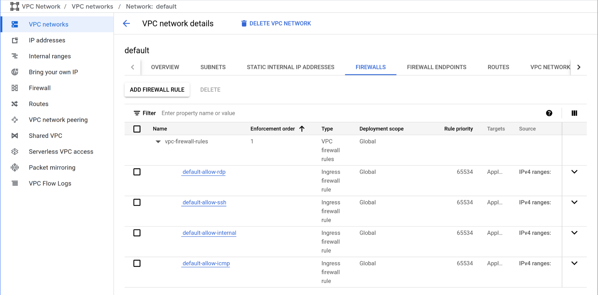
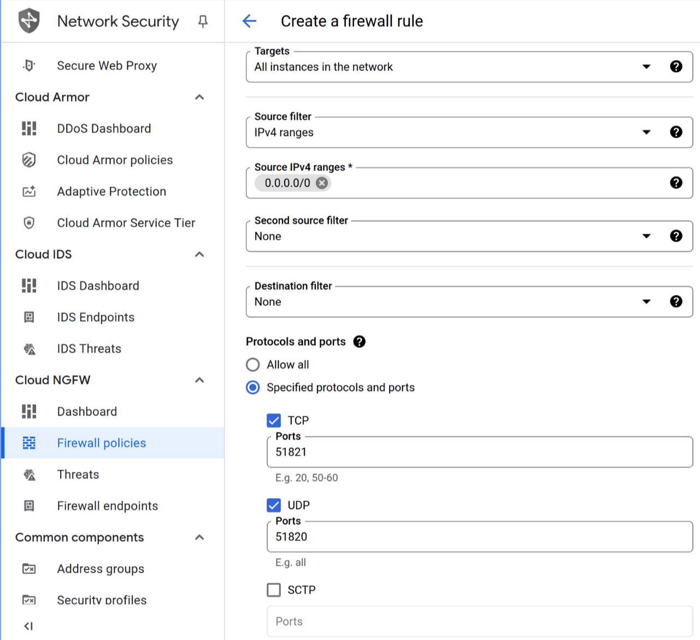
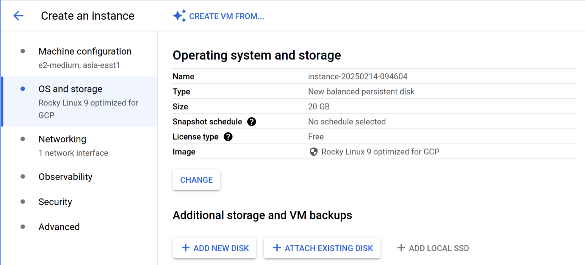
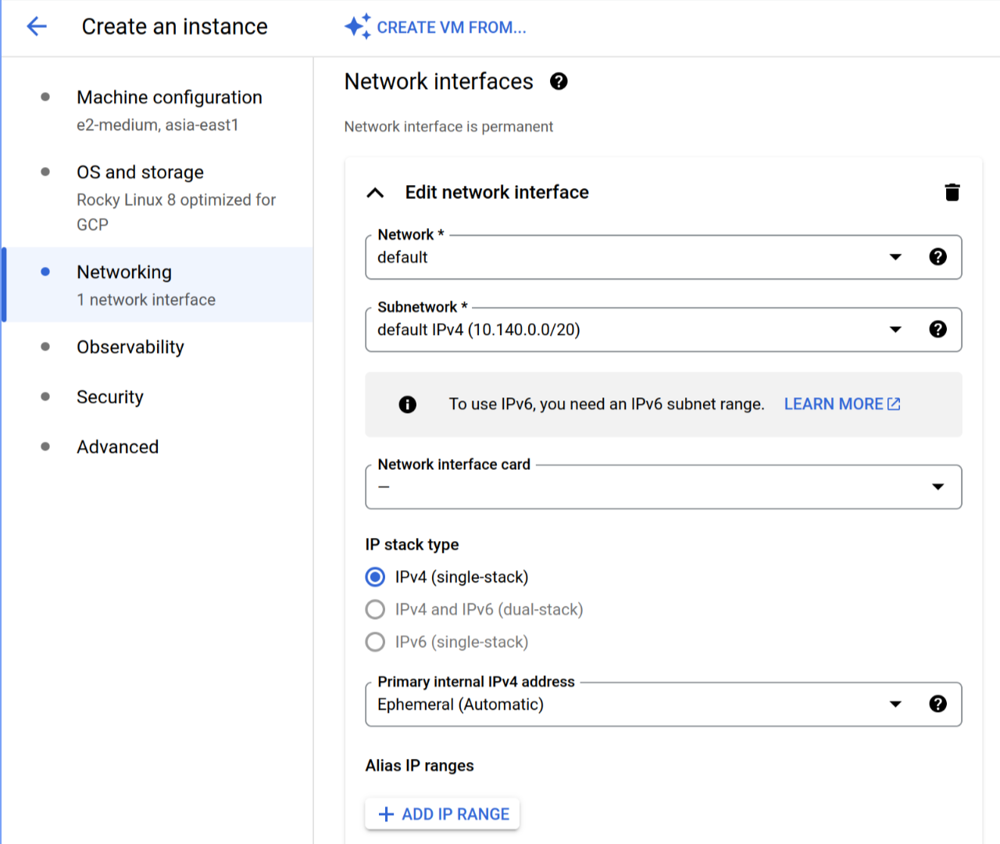
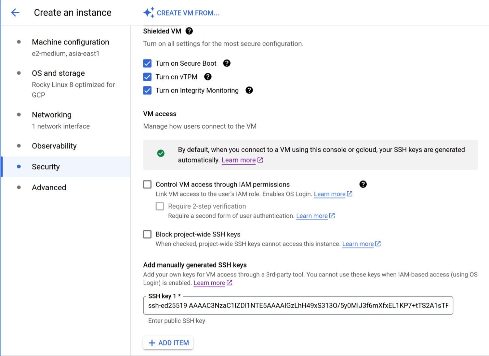

# Remote Access

## Setup a Virtual Private Server (VPS)

To remotely access a server, it must be internet-accessible, typically via a static IP. For servers with dynamic IPs, a dynamic DNS service can map the IP to a hostname. If dynamic DNS isn’t feasible (e.g., due to restricted router access preventing port forwarding), a VPS (e.g., from Google, Linode, Oracle) with a static IP can be used to establish a reverse VPN tunnel, enabling secure remote access.

### Google Cloud

#### Configure VPC Network Firewall

- Go to `Menu` → `VPC networks`, then select the network `default`, and go to the `FIREWALLS`:

  

- Select `ADD FIREWALL RULE` and set the following modifications for wireguard VPN:

  

- Add the UDP port `51820` (wireguard) and the TCP port `51821` (wireguard-gui):

  

- Save and verify the changes:

  

#### Create a VPS Instance

- Set the VPS image (OS) to Rocky Linux 8:

  

- Enable `IP forwarding` in the networking settings:

  

- Edit the network interface, and select the network `default`:

  

- Setup the external IPv4 address (static IPv4 address):

  

- Secure the server, and add your SSH public keys:

  > To list the SSH public keys in your machine, run the command `ssh-add -L`.

  

- Verify the configurations, then create the instance:

  
